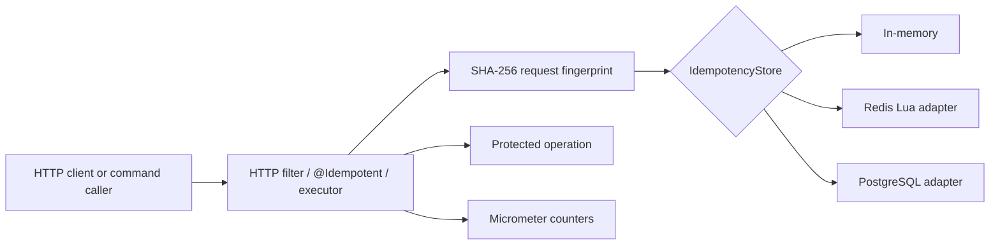
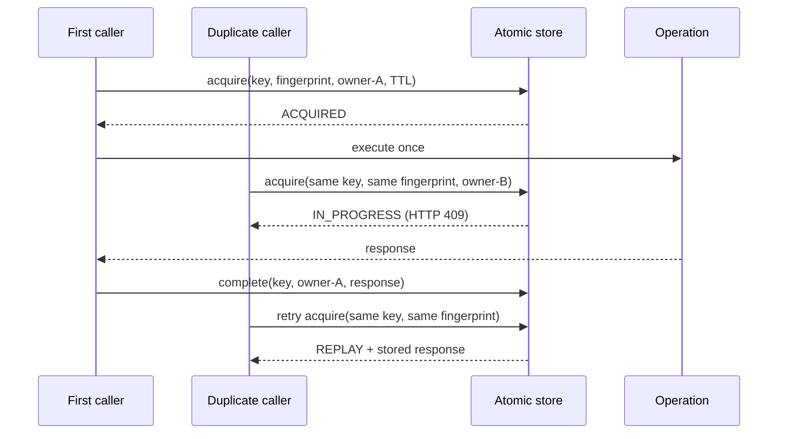

# Spring Idempotency

Spring Idempotency is a Spring Boot starter for safe, repeatable HTTP and command execution. It gives services one explicit idempotency boundary with atomic in-memory, Redis, and PostgreSQL stores.

[](https://github.com/aniket-deshkar/spring-idempotency/actions/workflows/ci.yml)
[](LICENSE)

## Problem Statement

Client retries, timeouts, redeliveries, and concurrent duplicate requests can execute the same side effect more than once. A local lock cannot protect a horizontally scaled service, and treating every repeated key as equivalent can replay a result for a different payload.

## What This Project Solves

The starter atomically claims a namespaced key and request fingerprint before invoking protected code. It distinguishes four outcomes:

- `ACQUIRED`: this caller owns execution.
- `IN_PROGRESS`: an equivalent caller already owns execution.
- `REPLAY`: the equivalent operation completed and its response is reusable.
- `CONFLICT`: the key exists but the payload fingerprint differs.

Only the owner token may complete or abandon an in-progress record. Completed responses remain replayable until their TTL expires.

## When To Use It

Use this library around operations such as order placement, payment intent creation, webhook processing, job submission, or message-driven commands where callers can safely provide a stable request key. Use Redis or PostgreSQL whenever more than one application instance can handle the same request. The in-memory store is intended for tests and single-instance workloads.

Idempotency does not make an arbitrary side effect atomic with its record. For a database-backed operation, keep the business mutation and idempotency completion in a transaction strategy appropriate to the application, or make the downstream side effect independently idempotent. A process failure after the side effect but before completion can otherwise permit execution after TTL.

## Architecture / HLD



The annotation, servlet filter, and programmatic executor all use the same store contract. Storage selection is configuration-driven, while applications can replace any bean.

## Detailed Design / LLD



An expired record can be acquired by a new owner. A failed protected operation calls `abandon`, allowing an immediate retry. An owner mismatch on completion fails loudly rather than overwriting another execution.

## Public API / API Structure

- `IdempotencyExecutor`: programmatic execution and replay boundary.
- `IdempotencyStore`: atomic storage service-provider interface.
- `StoredResponse`: status, content type, selected headers, and response bytes.
- `IdempotencyExecution`: response plus the `replayed` signal.
- `@Idempotent`: SpEL-driven method annotation.
- `IdempotencyHttpFilter`: servlet boundary for `POST`, `PUT`, and `PATCH`.
- `InMemoryIdempotencyStore`, `RedisIdempotencyStore`, and `PostgresIdempotencyStore`: included adapters.

Applications may provide their own `IdempotencyStore` bean. Auto-configuration backs off automatically.

## Core Concepts

### Keys and namespaces

HTTP keys are namespaced by method and request URI. Annotated method keys are namespaced by declaring class and method. Programmatic callers own their namespace and should include the business operation name.

### Fingerprints

The HTTP filter hashes method, URI, query, content type, and raw body. The annotation hashes either all serialized arguments or its explicit fingerprint SpEL expression. Programmatic calls supply raw payload bytes or a precomputed fingerprint.

### State and ownership

`IN_PROGRESS` records contain a random owner token. Only that token can complete or abandon the record. `COMPLETED` records include response bytes. The store transition, not a JVM lock, decides ownership.

### Duplicate behavior

An equivalent completed request replays. An equivalent concurrent request fails fast with `IdempotencyInProgressException` or HTTP `409`; the caller can retry with the same key. A different payload for the same key raises `IdempotencyConflictException` or HTTP `422`.

## Local Prerequisites

- JDK 21 or newer
- Git
- Docker-compatible runtime only for Redis and PostgreSQL integration tests

Maven installation is not required; the repository includes Maven Wrapper 3.9.12.

## Steps To Run

On Windows PowerShell:

```powershell
.\mvnw.cmd verify
```

On Linux or macOS:

```bash
./mvnw verify
```

When Docker is unavailable, Testcontainers integration tests are reported as skipped while deterministic unit, HTTP, annotation, concurrency, and auto-configuration tests still run.

## Configuration

```yaml
spring:
  idempotency:
    time-to-live: 24h
    store: REDIS # IN_MEMORY, REDIS, or POSTGRESQL
    redis-prefix: "idempotency:"
    initialize-postgres-schema: false
    http:
      enabled: true
      require-key: true
      key-header: Idempotency-Key
```

`IN_MEMORY` is the default. Select `REDIS` only when a `StringRedisTemplate` is available. Select `POSTGRESQL` only when a `JdbcTemplate` is available. Production database migrations should apply the schema independently; `initialize-postgres-schema` is an opt-in convenience.

The PostgreSQL schema is available at [`src/main/resources/io/github/aniketdeshkar/idempotency/postgresql-schema.sql`](src/main/resources/io/github/aniketdeshkar/idempotency/postgresql-schema.sql).

## Usage Examples

### Programmatic command

```java
IdempotencyExecution execution = executor.execute(
    "place-order:" + requestId,
    objectMapper.writeValueAsBytes(command),
    () -> {
      Receipt receipt = orderService.place(command);
      return new StoredResponse(
          201, "application/json",
          Map.of("Location", "/orders/" + receipt.id()),
          objectMapper.writeValueAsBytes(receipt));
    });
```

### Annotated service method

```java
@Idempotent(
    key = "#requestId",
    fingerprint = "#command.customerId() + ':' + #command.total()",
    ttlSeconds = 86400)
public Receipt place(String requestId, PlaceOrder command) {
  return repository.save(command);
}
```

Parameter names are available because the build compiles with `-parameters`. Fingerprint expressions should include every argument that changes operation semantics.

### HTTP replay

Enable the filter and send a key on a protected method:

```bash
curl -i -X POST http://localhost:8080/orders \
  -H 'Content-Type: application/json' \
  -H 'Idempotency-Key: checkout-4fba' \
  -d '{"sku":"book","quantity":2}'
```

The response includes `Idempotency-Replayed: false` for the owner and `true` for a completed replay. The filter preserves the stored status, content type, body, and first value of each response header.

## Testing

The default verification includes:

- concurrent equivalent-call ownership with exactly one protected execution;
- completed replay and same-key/different-payload conflict behavior;
- failed-operation abandonment and TTL reacquisition;
- HTTP response capture, replay, missing-key, and conflict behavior;
- typed annotation replay with SpEL key and fingerprint extraction;
- Spring Boot auto-configuration checks;
- Redis Lua and PostgreSQL adapter integration tests through Testcontainers.

Run only tests with `./mvnw test`. Run formatting and static analysis together with all tests using `./mvnw verify`.

## Observability

When an application supplies a `MeterRegistry`, the starter emits `idempotency.requests` with an `outcome` tag: `acquired`, `replayed`, `conflict`, `in_progress`, or `failed`.

Tags intentionally exclude idempotency keys, URIs, and payload data to avoid high cardinality and sensitive-data leakage. The library does not log payloads or stored response bodies.

## Security

Treat keys as opaque untrusted input and enforce size limits at the edge. Do not put credentials or personal data in keys. Fingerprints are one-way SHA-256 digests, but stored response bodies can contain sensitive data; secure the backing store with network isolation, authentication, encryption, and least privilege. Choose the shortest TTL consistent with the retry window.

See [SECURITY.md](SECURITY.md) for vulnerability reporting and the supported release policy.

## Repository Structure

```text
src/main/java/io/github/aniketdeshkar/idempotency/
|-- annotation/       # @Idempotent and its aspect
|-- autoconfigure/    # Boot properties and bean wiring
|-- http/             # Servlet request capture and response replay
|-- store/            # In-memory, Redis, and PostgreSQL adapters
`-- *.java            # Core state machine and programmatic API
src/main/resources/   # Auto-configuration registration and SQL schema
src/test/java/        # Unit, web, proxy, auto-config, and container tests
```

## Design Decisions / Trade-offs

- Concurrent duplicates fail fast instead of occupying request threads while waiting. Callers retry using the same key.
- Raw HTTP bodies make fingerprints deterministic; semantic JSON normalization is intentionally left to programmatic or annotation expressions.
- Response replay stores bytes rather than Java objects, preserving protocol results across application instances and versions.
- Owner tokens prevent stale workers from completing a record reacquired after TTL.
- Redis scripts provide a server-side atomic transition. PostgreSQL uses primary-key and conditional-update arbitration.
- Explicit application transaction guidance is preferred over implying that the idempotency record and an unrelated side effect are automatically atomic.

## Contributing

Read [CONTRIBUTING.md](CONTRIBUTING.md), create a focused branch, add tests for behavioral changes, and run `./mvnw verify` before opening a pull request.

## License

Licensed under the [Apache License 2.0](LICENSE).
